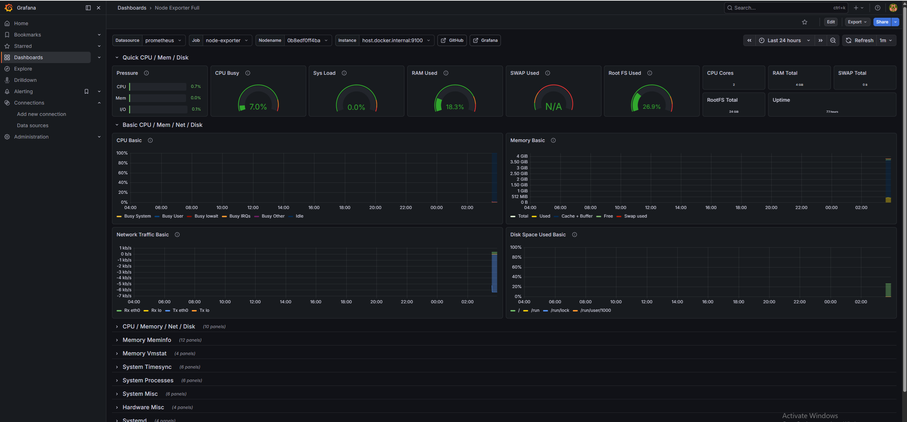
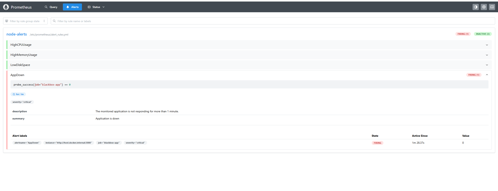

# DevOps End-to-End Project on Ubuntu Server

This project demonstrates an end-to-end DevOps workflow built on a single Ubuntu Server VM, covering application containerization, CI/CD, reverse proxy setup, health checks, monitoring, and alerting.

## Project Overview

In this lab, I built and tested a complete DevOps-style setup including:

- A Dockerized Node.js application
- Nginx reverse proxy
- Custom Bash health-check automation
- Cron-based recurring checks
- GitHub Actions CI workflow
- Prometheus monitoring
- Node Exporter for system metrics
- Blackbox Exporter for application availability checks
- Grafana dashboards
- Prometheus alert rules for infrastructure and application health

## Architecture

This project follows a simple end-to-end DevOps architecture:

User → Nginx → Node.js Application  
               ↓  
        Blackbox Exporter  
               ↓  
           Prometheus  
               ↓  
            Grafana  

## What I Built

### Application and Deployment
- Developed a simple Node.js application
- Containerized the application using Docker
- Exposed the application on port 3000
- Configured Nginx as a reverse proxy

### Health Checks and Self-Healing
- Wrote a custom `monitor.sh` script
- Checked CPU, disk, and Nginx status
- Automated checks using cron
- Simulated failure by stopping Nginx and verified automatic recovery via monitoring script

### CI/CD
- Added a GitHub Actions workflow for Docker image build automation
- Used GitHub as the source control platform for the lab

## Monitoring and Observability

Installed Node Exporter to collect host-level metrics  
Installed Prometheus to scrape and evaluate metrics  
Installed Grafana for dashboard visualization  
Installed Blackbox Exporter to probe application availability and HTTP response status  
Visualized CPU, memory, disk, network, and app health metrics in Grafana  

### Grafana Dashboard


### Alerting
Created Prometheus alert rules with severity levels:

High CPU usage (warning)
High memory usage (warning)
Low disk space (critical)
Application downtime (critical)

Configured alert evaluation duration (for) and tested alert lifecycle:
Inactive → Pending → Firing

## Alert Example

The following screenshot shows a real alert in FIRING state when the application was intentionally stopped:



## Tech Stack

- Ubuntu Server
- Node.js
- Docker
- Nginx
- Bash
- Cron
- GitHub Actions
- Prometheus
- Node Exporter
- Blackbox Exporter
- Grafana

## Monitoring Flow

- Node Exporter exposes system metrics
- Prometheus scrapes Node Exporter metrics
- Blackbox Exporter probes the application endpoint
- Prometheus evaluates alert rules
- Grafana visualizes metrics through dashboards

## Failure Tests Performed

- Stopped Nginx to test self-healing behavior
- Stopped the application container to test Blackbox monitoring
- Observed alert state transitions such as:
  - Inactive
  - Pending
  - Firing
- Verified metric recovery after service restoration

## Repository Structure

```text
.
├── .github/workflows/
├── monitoring/
│   ├── prometheus.yml
│   └── alert_rules.yml
├── Dockerfile
├── app.js
├── monitor.sh
├── package.json
└── README.md

Key Outcomes
Built a hands-on DevOps project from deployment to observability
Practiced Docker-based application delivery
Implemented monitoring and alerting with Prometheus and Grafana
Simulated service failures and validated recovery and alert behavior
Gained experience with production-style troubleshooting on Linux


## Commit ve push

```bash
git add .
git commit -m "Integrate monitoring and alerting into end-to-end DevOps project"
git push
